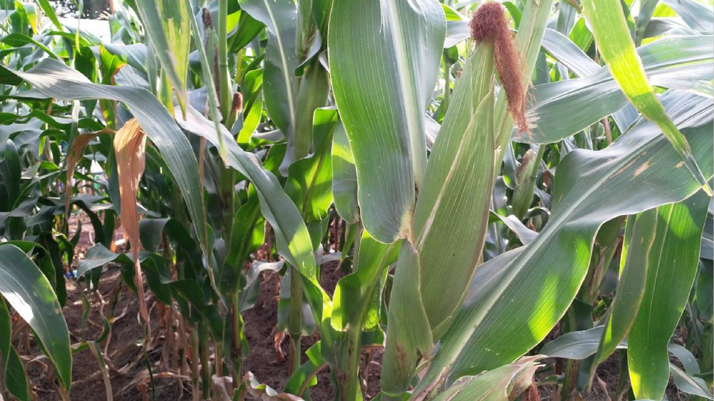

:::: {.grid}

::: {.g-col-md-8 .g-col-12 .mt-3}

# Maize

Maize is the most important cereal crop in Kenya. It is the staple food for most rural population. It is used as a human food, animal feed, production of beverages and also making of bio-fuel. Maize is a versatile crop with a wide genetic base and a large number of varieties growing across a range of agro-ecological zones (AEZ) and soil types and having differing maturity periods. However, maize grows best on well-drained, well-aerated, deep soils containing adequate organic matter and well supplied with requisite nutrients. Maize will produce 2 metric tons per hectare under good management

- Read more at [keep.kalro.org](https://keep.kalro.org/good-agricultural-practices/Maize)

:::

::: {.g-col-md-4 .g-col-12 .mt-3}

    

:::

::::

---

:::: {.grid}

::: {.g-col-md-4 .g-col-12 .mt-3}
## LSC resources

Relevant resources about maize in the LSC hub

:::

::: {.g-col-md-4 .g-col-12 .mt-3}

## Soil and landscape in your area

:::

::: {.g-col-md-4 .g-col-12 .mt-3}
## Other resources

- [Maize Crop Calendar](https://cropcalendar.apps.fao.org/#/home?id=KE&crops=0113) (FAO)
- [Management practices](https://qcat.wocat.net/en/wocat/list/?type=wocat&q=maize&filter__qg_location__country=country_KEN) (Wocat)
- [Higher maize yields, a guide to good agronomic practices in smallholder systems](https://www.apni.net/wp-content/uploads/2020/12/Higher-Maize-Yield-0720.pdf) (APNI)
- [Maize crop nutrient input requirements for food security in sub-Saharan Africa](https://doi.org/10.1016/j.gfs.2019.02.001) (Wageningen University)
:::

::::

---

